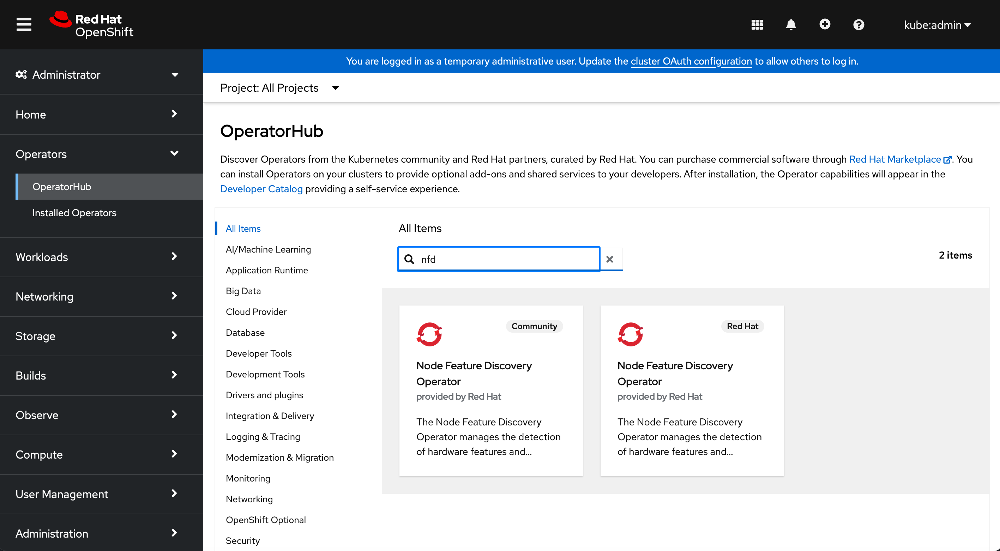

# Deploy AMD GPU Operator on OpenShift Cluster

## 1. PreCheck
The OpenShift cluster should be up and running as an assumption, the following operators should be enabled in order to properly deploy and use AMD GPU Operator.
They are enabled by-default for the Openshift cluster.

* 1.1 Service-CA 
Service-CA operator will be used to sign the certificate and ingest the certificate into webhook server, in order to authenticate the communication between kube-api-server and KMM webhook server.

```
[core@68-05-ca-a8-3d-c8 ~]$ oc get pods -A | grep service-ca
openshift-service-ca-operator                      service-ca-operator-7d65f5495d-tjztl                              1/1     Running     7                35d
openshift-service-ca                               service-ca-585754fd76-9qz66                                       1/1     Running     6                35d
```

* 1.2 Operator Lifecycle Manager (OLM)
OLM will be used to install AMD GPU operator and all the dependencies operators by the OLM bundle.

```
[core@68-05-ca-a8-3d-c8 ~]$ oc get pods -A | grep operator-lifecycle
openshift-operator-lifecycle-manager               catalog-operator-566d45b946-q7btp                                 1/1     Running     8 (2d18h ago)    35d
openshift-operator-lifecycle-manager               olm-operator-7869f849d4-pjt49                                     1/1     Running     6                35d
openshift-operator-lifecycle-manager               package-server-manager-8bb964f86-wpwnl                            2/2     Running     13               35d
openshift-operator-lifecycle-manager               packageserver-58bfc579b7-h2v5d                                    1/1     Running     6                35d
```

* 1.3 MachineConfig Operator 
MachineConfig operator is required for configuring the blacklist on inbox amdgpu driver.

```
[core@68-05-ca-a8-3d-c8 ~]$ oc get pods -A | grep machine-config
openshift-machine-config-operator                  kube-rbac-proxy-crio-68-05-ca-a8-3d-c8                            1/1     Running     12               35d
openshift-machine-config-operator                  machine-config-controller-5bdbbc9cf4-9zhzv                        2/2     Running     14               35d
openshift-machine-config-operator                  machine-config-daemon-76cqc                                       2/2     Running     22               35d
openshift-machine-config-operator                  machine-config-operator-86b6764d7-2phqs                           2/2     Running     14               35d
openshift-machine-config-operator                  machine-config-server-rghbg                                       1/1     Running     8                35d
```

* 1.4 Cluster Image Registry Operator
Cluster image registry operator is required to trigger the driver image build within OpenShift cluster, as well as storing driver image if users want to use OpenShift internal registry.

```
[core@68-05-ca-a8-3d-c8 ~]$ oc get pods -A | grep image-registry
openshift-image-registry                           cluster-image-registry-operator-66544d6c88-zw829                  1/1     Running     6                35d
openshift-image-registry                           node-ca-mdlvp                                                     1/1     Running     8                35d
```

## 2. Install Dependencies

### 2.1 Enable OpenShift Internal Image Registry

Oepnshift Internal Image resitry need to be enabled if users want to build the driver image within the cluster. Use the following commands to enable it:

2.1.1 Check whether image registry was already running or not:

Cluster image registry operator should be running after doing precheck, the pod ```cluster-image-registry-operator``` should be running within the cluster. If there is no worker pod named like ```image-registry-586cdfbb85-rlv84``` running under ```openshift-image-registry``` namespace, that means the image registry was not configured and enabled, users need to go through all the steps within 2.1 to enable the image registry.
```
[core@68-05-ca-a8-3d-c8 ~]$ oc get pods -A | grep image-registry
openshift-image-registry                           cluster-image-registry-operator-66544d6c88-zw829                  1/1     Running     6                35d
openshift-image-registry                           node-ca-mdlvp                                                     1/1     Running     8                35d
```

2.1.2 Configure the storage of image registry: 

Here image registry is using ```emptyDir``` as the storage configuration, users could change the storage configuration for their own usage.
```
oc patch configs.imageregistry.operator.openshift.io cluster --type merge --patch '{"spec":{"storage":{"emptyDir":{}}}}'
```

2.1.3 Enable the internal image registry: 
```
oc patch configs.imageregistry.operator.openshift.io cluster --type merge --patch '{"spec":{"managementState":"Managed"}}'
```

2.1.4 Make sure the image-registry pod is up and running: 

The worker pod ```image-registry-586cdfbb85-rlv84``` is up and running
```
[core@68-05-ca-a8-3d-c8 ~]$ oc get pods -n openshift-image-registry
NAME                                               READY   STATUS      RESTARTS   AGE
cluster-image-registry-operator-66544d6c88-zw829   1/1     Running     6          35d
image-registry-586cdfbb85-rlv84                    1/1     Running     1          6d22h
node-ca-mdlvp                                      1/1     Running     8          35d
```
Check the pod spec of the image registry worker pod, users could found the corresponding information of the image registry
```
[core@68-05-ca-a8-3d-c8 ~]$ oc get pod -n openshift-image-registry image-registry-586cdfbb85-rlv84 -oyaml | grep REGISTRY_OPENSHIFT_SERVER_ADDR -A 5
    - name: REGISTRY_OPENSHIFT_SERVER_ADDR
      value: image-registry.openshift-image-registry.svc:5000
    - name: REGISTRY_HTTP_TLS_CERTIFICATE
      value: /etc/secrets/tls.crt
    - name: REGISTRY_HTTP_TLS_KEY
      value: /etc/secrets/tls.key
```

### 2.2 Install Node Feature Discovery (NFD) Operator

Go to the OepnShift Web Console and select OperatorHub, search for the Node Feature Discovery operator, then install the ```RedHat``` version operator on users OpenShift cluster. 



### 2.3 Install Kernel Module Management (KMM) Operator

Go to the OepnShift Web Console and select OperatorHub, search for the Kernel Module Management operator, then install the RedHat version ```without Hub label``` on users OpenShift cluster. 


## 3. Install AMD GPU Operator

Currently we haven’t published the AMD GPU operator to the OperatorHub, we need to use the Operator SDK to install / uninstall the AMD GPU Operator OLM bundle. 

* Install the kubectl binary on dev/test environment 

* Copy OpenShift cluster’s kubeconfig to ~/.kube/config at dev/test environment 

* Run some kubectl command to confirm the access to OpenShift cluster from dev/test environment

* Download Operator SDK: Go to https://sdk.operatorframework.io/docs/installation/ and follow the corresponding method to download operator SDK to users dev/test environment 

* Deploy the OLM bundle 
```
./bin/operator-sdk run bundle docker.io/yan1996/amd-gpu-operator-bundle:v0.0.1 --namespace=default 
```

The OLM bundle image will be publicized as part of AMD GPU Operator release, the image URL may change and tag will be updated in the future.

If users want to deploy the AMD GPU operator to another namespace, users have to create it before deploying the OLM bundle, e.g. ```kubectl create ns newNameSpace ```

After deploying the OLM bundle users should see the operator’s controller manager up and running.

```
[core@68-05-ca-a8-3d-c8 ~]$ oc get pods
NAME                                                              READY   STATUS      RESTARTS   AGE
4260741f535bd5993bfc2c0582f19f6046163396895c1880f4a35ed851gcvm5   0/1     Completed   0          3d2h
amd-gpu-operator-controller-manager-556dbbf6f5-k9wvd              1/1     Running     1          3d2h
docker-io-yan1996-amd-gpu-operator-bundle-v0-0-1                  1/1     Running     1          3d2h
```

# 4. Create Custom Resource (CR)
## 4.1 Create Node Feature Dsicovery Rule
In order to detect which OpenShift worker node has AMD GPU hardware installed, the NFD operator could help users do the detection by searching among the PCI device list.

Users could create this resource to the cluster, then AMD GPU PCI device could be detected by NFD operator, and corresponding worker node will be labeled as ```feature.node.kubernetes.io/amd-gpu: "true" ```

```
apiVersion: nfd.openshift.io/v1 
kind: NodeFeatureDiscovery 
metadata: 
  name: amd-gpu-operator-nfd-instance 
  namespace: default 
spec: 
  operand: 
    image: quay.io/openshift/origin-node-feature-discovery:4.16 
    imagePullPolicy: IfNotPresent 
    servicePort: 12000 
  workerConfig: 
    configData: | 
      core: 
        sleepInterval: 60s 
      sources: 
        pci: 
          deviceClassWhitelist: 
            - "0200" 
            - "03" 
            - "12" 
          deviceLabelFields: 
            - "vendor" 
            - "device" 
        custom: 
        - name: amd-gpu 
          labels: 
            feature.node.kubernetes.io/amd-gpu: "true" 
          matchAny: 
            - matchFeatures: 
                - feature: pci.device 
                  matchExpressions: 
                    vendor: {op: In, value: ["1002"]} 
                    device: {op: In, value: ["74a0"]} # MI300A 
            - matchFeatures: 
                - feature: pci.device 
                  matchExpressions: 
                    vendor: {op: In, value: ["1002"]} 
                    device: {op: In, value: ["74a1"]} # MI300X 
            - matchFeatures: 
                - feature: pci.device 
                  matchExpressions: 
                    vendor: {op: In, value: ["1002"]} 
                    device: {op: In, value: ["740f"]} # MI210 
            - matchFeatures: 
                - feature: pci.device 
                  matchExpressions: 
                    vendor: {op: In, value: ["1002"]} 
                    device: {op: In, value: ["7408"]} # MI250X 
            - matchFeatures: 
                - feature: pci.device 
                  matchExpressions: 
                    vendor: {op: In, value: ["1002"]} 
                    device: {op: In, value: ["740c"]} # MI250/MI250X 
            - matchFeatures: 
                - feature: pci.device 
                  matchExpressions: 
                    vendor: {op: In, value: ["1002"]} 
                    device: {op: In, value: ["738c"]} # MI100 
            - matchFeatures: 
                - feature: pci.device 
                  matchExpressions: 
                    vendor: {op: In, value: ["1002"]} 
                    device: {op: In, value: ["738e"]} # MI100 
```

```
[core@68-05-ca-a8-3d-c8 ~]$ oc get node -oyaml | grep "amd-gpu"
      feature.node.kubernetes.io/amd-gpu: "true"
```

## 4.2 Create DeviceConfig

DeviceConfig is the custom resource for AMD GPU Operator, by creating the DeviceConfig the operator will be triggered to install AMD GPU driver.

For example:

```
apiVersion: amd.com/v1alpha1 
kind: DeviceConfig 
metadata: 
  name: test-cr 
  namespace: default 
spec: 
  devicePluginImage: rocm/k8s-device-plugin:latest 
  driversVersion: el9-6.1.1 
  selector: 
    "feature.node.kubernetes.io/amd-gpu": "true" 
```

Then the Operator and its dependencies operators should receive the create event of the DeviceConfig and do proper actions.

* The AMD GPU Operator will collect the worker node's system spec, including Linux distros, release version, kernel version to check whether corresponding driver image exist in the image registry or not.
* If the driver image doesn't exist in the OpenShift internal registry, KMM will init a builder pod to build the driver image within the cluster, then push the built driver image to the registry.
* Once confirmed the worker node's driver image exists, KMM will send a worker pod to the worker node, then the worker pod will pull the prepared driver image to install the kernel module on the worker node by using ```modprobe``` commands. 

```
kmm-worker-68-05-ca-a8-3d-c8-test-cr                              1/1     Running     0          6s
```
* If the installation was successful, ROCM device plugin and node labeller will be deployed on the worker node

```
test-cr-device-plugin-nf5rp-hjmnw                                 1/1     Running     0          15s
test-cr-node-labeller-tvf5q                                       1/1     Running     0          15s
```

and AMD GPU related labels will be attached to the corresponding worker node, where ```amd.com/gpu``` is OpenShift allocatable resource quota of each worker node, users could schedule and request ```amd.com/gpu``` resource for their GPU workloads.

```
[core@68-05-ca-a8-3d-c8 ~]$ oc get node -ojson | grep amd.com
            "beta.amd.com/gpu.cu-count.104": "1",
            "beta.amd.com/gpu.device-id.740f": "1",
            "beta.amd.com/gpu.family.AI": "1",
            "beta.amd.com/gpu.simd-count.416": "1",
            "beta.amd.com/gpu.vram.64G": "1",
            "amd.com/gpu": "1",
            "amd.com/gpu": "1",
```
